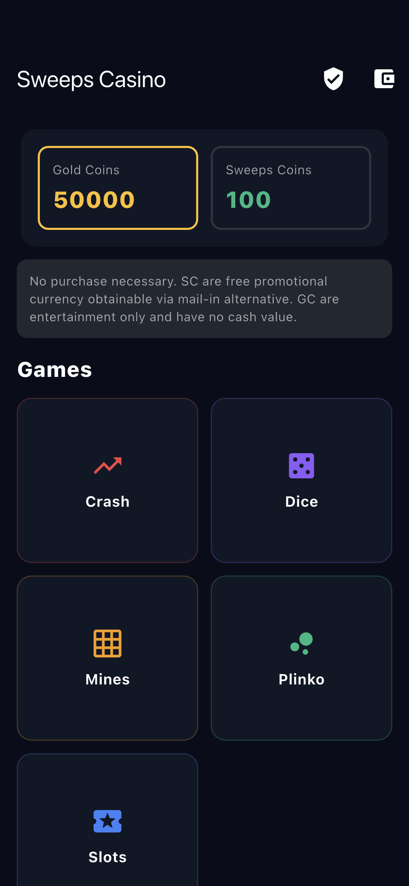
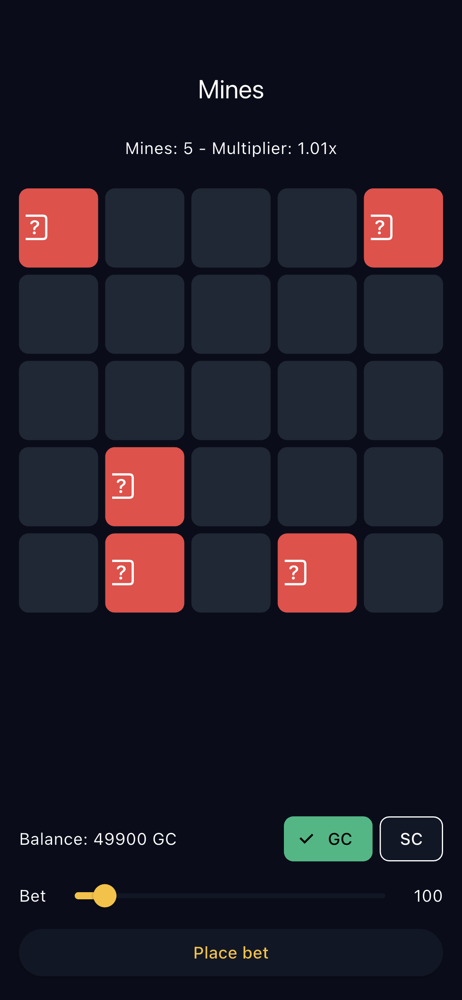
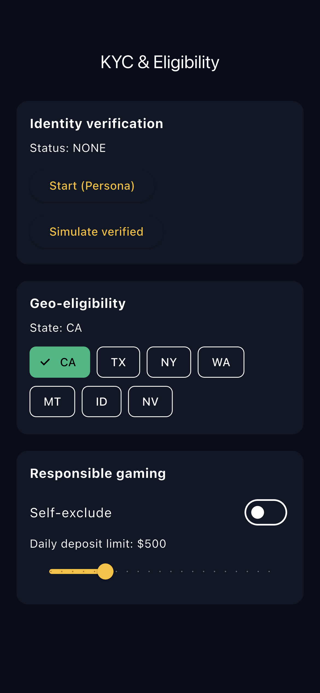
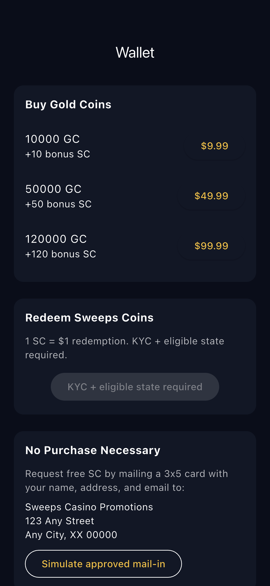
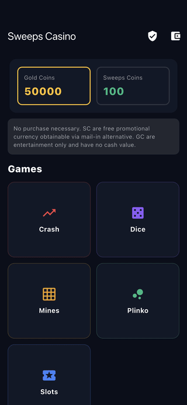

# flutter-sweepstakes-casino

Flutter POC for a sweepstakes-model mobile casino (dual-currency GC/SC), modeled after the Crash or Cash game suite. Built to prove the core compliance and game-suite structure an app like this needs before wiring a real backend.

## Demo

Real captures from the running app on the iOS Simulator (iPhone 16e), not mockups. See [FLOW.md](FLOW.md) for how they are regenerated.

| Home (dual-currency wallet + game suite) | Mines (live board + cashout) |
| --- | --- |
|  |  |
| KYC & eligibility | Wallet (buy GC, redeem SC, no-purchase-necessary) |
|  |  |



## Features

- **Dual-currency wallet** - Gold Coins (entertainment, purchased) + Sweeps Coins (free promotional, redeemable for prizes)
- **Game suite** - Crash (live multiplier + cashout), Dice (roll-under, variable multiplier), Mines (5x5 grid, configurable mines, cashout), Plinko (binomial drop, 9 buckets), Slots (3-reel, match multipliers)
- **No-purchase-necessary flow** - mail-in alternative wired to wallet credit simulation
- **KYC + eligibility** - Persona-style status machine (none/pending/verified), prohibited-state enforcement (`kProhibitedStates`), SC redemption gated on `isEligibleForRealMoney`
- **Responsible gaming** - self-exclusion toggle, daily deposit limit slider
- **Package layout** - `lib/src/{data,models,features/{home,wallet,kyc,games/*}}` with Riverpod state

## Backend stubbed, ready to wire

- Purchase flow -> plug in high-risk payment gateway (processor TBD per job)
- KYC -> swap the status machine for Persona Embedded SDK callbacks
- Redemption -> ACH or crypto payout API
- Admin dashboard, geo-blocking by IP, abuse detection all live server-side

## Stack

Flutter 3.x, Riverpod, go_router, Material 3 dark theme. Pure Dart game logic for unit testing.

## Run

```
flutter pub get
flutter run
```
